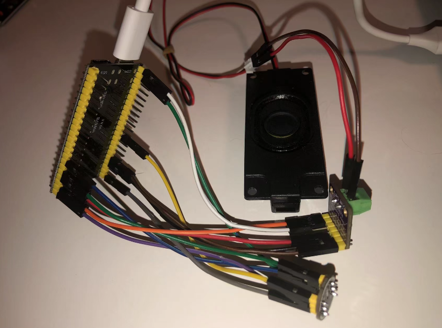
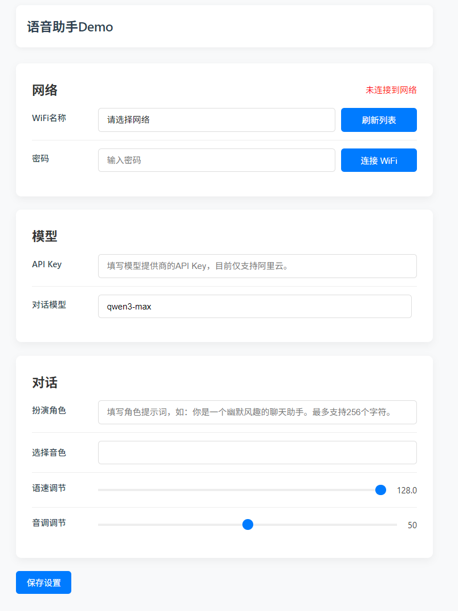

# 使用ESP32的语音对话机器人

这是一个基于ESP32-S3的对话机器人Demo，实现了以下功能：

- WiFi连接配网
- 语音对话
- 系统配置

## 硬件

- ESP32-S3N16R8：运行程序
- INM441：麦克风
- MAX98357A：喇叭

共花费 37.68 RMB

麦克风接线参考：[mic.rs](https://github.com/xgpxg/esp32-voice-assistant-demo/blob/master/src/client/mic.rs)

喇叭接线参考：[speaker.rs](https://github.com/xgpxg/esp32-voice-assistant-demo/blob/master/src/client/speaker.rs)



## 软件

- 语言：Rust
- 核心框架：esp-idf-svc
- 模型服务：阿里百炼平台

## 运行

```shell
cargo run -r
```

> 需提前安装所需环境，可参考：[esp-idf-svc](https://github.com/esp-rs/esp-idf-svc)

## 配置页面

地址：`http://192.168.71.1`

首次运行需先连接WiFi并填写API Key。API Key可从阿里百炼平台获取。

截图： 